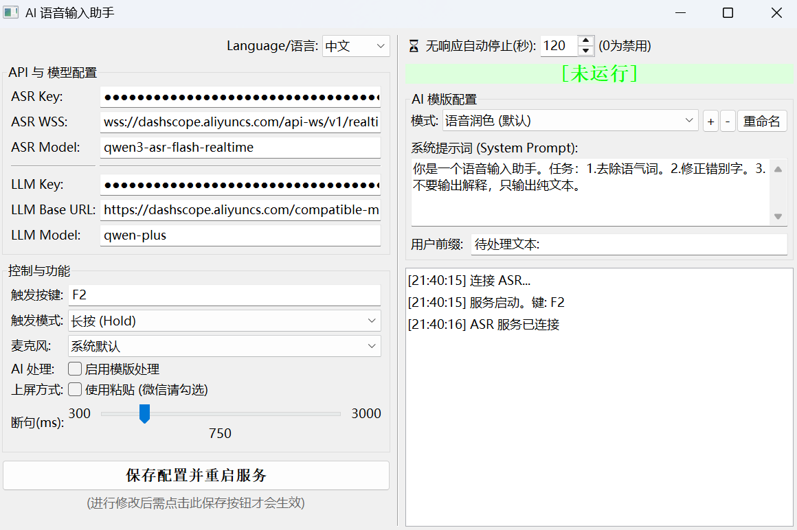
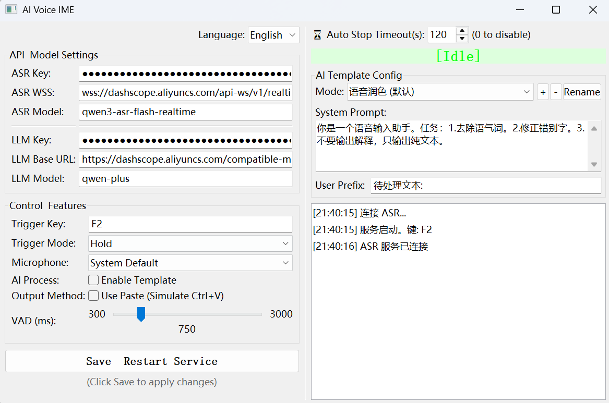

[[中文说明]](README-zh.md)

# AI Voice Input Method (Yinput)

## Project Overview

This is a Windows-based AI voice input method tool that converts your speech into text through real-time speech recognition (ASR), optionally enhances it with a large language model (LLM) for polishing, translation, or Q&A, and finally inputs the result into any currently focused application.

The project is inspired by the mobile app [BiBi-Keyboard](https://github.com/BryceWG/BiBi-Keyboard), and since no similar PC-side project was found, an attempt was made to implement it independently using AI.

This program is a PC implementation written in Python, using wxPython for the GUI and Win32 API for low‑level keyboard injection.

  

**Core Features**:
- **Real‑time speech recognition**: Integrates Alibaba Cloud DashScope’s real‑time ASR service with streaming support and low latency,supporting 24 languages and dialects including Chinese (Mandarin, Sichuanese, Hokkien, Wu), Cantonese, English, Japanese, German, Korean, Russian, French, Portuguese, Arabic, Italian, Spanish, Hindi, Indonesian, Thai, Turkish, Ukrainian, Vietnamese, Czech, Danish, Filipino, Finnish, Icelandic, Malay, Norwegian, Polish, and Swedish.
- **AI post‑processing**: Built‑in OpenAI‑compatible interface, compatible with Qwen, DeepSeek, ChatGPT, etc., to polish, translate, or answer questions based on the recognized text.
- **Flexible triggering**: Supports keyboard keys (F1‑F12) or mouse side‑buttons (X1/X2) with two recording modes: HOLD and TOGGLE.
- **Smart timeout**: Automatically stops recording after a period of no speech activity to avoid unnecessary API charges.
- **Template system**: Customizable AI processing templates for quick switching between tasks (e.g., “Speech polishing”, “Chinese‑to‑English translation”, “AI Q&A”).
- **Cross‑application input**: Injects text into any window via Win32 input simulation or clipboard paste.

## Features

- **Real‑time speech‑to‑text**: Uses Alibaba Cloud Qwen ASR real‑time streaming recognition.
- **AI text processing**: Optional LLM enhancement to remove filler words, correct typos, translate, answer questions, etc.
- **Multiple trigger options**:
  - Keyboard: F1~F12 function keys (default F2)
  - Mouse: Side buttons MouseX1 / MouseX2
- **Two recording modes**:
  - **HOLD**: Press and hold the trigger key to record, release to stop and output.
  - **TOGGLE**: Press once to start recording, press again to stop; sentences are automatically split based on the configured pause threshold.
- **Auto‑stop protection**: In TOGGLE mode, if no speech is detected for a user‑defined period, recording stops automatically to prevent forgotten sessions and unwanted charges.
- **Template management**: Add, delete, rename AI processing templates; each template includes a system prompt and a user prefix.
- **Persistent configuration**: All settings are saved in `config.ini` and reloaded on restart.
- **WeChat compatibility**: “Paste input” option avoids a WeChat‑specific bug that replaces the first character with punctuation.
- **Device selection**: Choose a specific microphone device; defaults to the system default.

## Quick Start

### Requirements

- **Operating System**: Windows 10/11 (requires Win32 API)
- **Python**: 3.7+ (this release includes an embedded Python 3.12, no separate installation needed)
- **Dependencies**: Listed in `requirements.txt`; install with `pip install -r requirements.txt`.

### Download & Run

1. **Download the project**: Get the whole folder from the releases page or repository.
2. **Obtain API keys**:
   - Go to the [Alibaba Cloud DashScope console](https://bailian.console.aliyun.com/?tab=doc#/doc/?type=model&url=2989727) to enable the real‑time ASR service and obtain an API Key.
   - For LLM functionality, you can use the same API Key or create a separate one in the same console.
3. **First run**:
   - Execute `python voice_ime.py`, then the GUI will appear.
   - Fill in the ASR Key, LLM Key, and other settings in the UI, then click “Save configuration and restart services”.
4. **Start using**:
   - Press the configured trigger key (default F2) to start speaking; release (HOLD mode) or press again (TOGGLE mode) to stop.
   - The recognized text will be automatically typed into the currently focused window.

### Configuration File

After the first run, a `config.ini` file is created in the same directory, containing all adjustable parameters. You can edit it directly or modify values in the GUI and save.

Key configuration items:
- `asr_api_key`: API Key for Alibaba Cloud real‑time ASR.
- `asr_url`: ASR service endpoint (Mainland China: `wss://dashscope.aliyuncs.com/api‑ws/v1/realtime`, outside China: `wss://dashscope‑intl.aliyuncs.com/api‑ws/v1/realtime`).
- `asr_model`: ASR model name, default `qwen3‑asr‑flash‑realtime`.
- `llm_api_key`: API Key for the LLM service.
- `llm_base_url`: OpenAI‑compatible endpoint (Qwen Beijing: `https://dashscope.aliyuncs.com/compatible‑mode/v1`, Singapore: `https://dashscope‑intl.aliyuncs.com/compatible‑mode/v1`).
- `llm_model`: LLM model name, e.g., `qwen‑plus`, `qwen‑turbo`.
- `trigger_key`: Trigger key, options: `F1`~`F12`, `MouseX1`, `MouseX2`.
- `input_mode`: Recording mode, `HOLD` or `TOGGLE`.
- `auto_stop_timeout`: Auto‑stop timeout in seconds; 0 to disable.
- `use_paste`: Whether to use paste input (recommended for WeChat).

## Detailed Configuration Guide

### 1. ASR Configuration

- **Obtaining API Key**:
  1. Log into the [Alibaba Cloud DashScope console](https://bailian.console.aliyun.com/).
  2. Enable the “Real‑time Speech Recognition” service.
  3. Create a Key in the [API Key management page](https://help.aliyun.com/zh/model‑studio/get‑api‑key).
- **Service Endpoints**:
  - Users in Mainland China are advised to use the Beijing server for lower cost and latency.
  - The Singapore server is also available (approximately twice the price).
- **Model Selection**: Currently `qwen3‑asr‑flash‑realtime` is recommended for a good balance of speed and accuracy.

### 2. LLM Configuration

- **Compatible Interface**: The program uses the OpenAI SDK, so any model providing an OpenAI‑compatible endpoint can be used.
- **Recommended Models**:
  - **Qwen‑plus**: Good cost‑performance ratio for most scenarios.
  - **Qwen‑turbo**: Cheaper, faster, suitable for simple tasks.
  - Others: DeepSeek, ChatGPT, etc. Just change `llm_base_url` and `llm_model`.
- **Endpoint URLs**:
  - Beijing: `https://dashscope.aliyuncs.com/compatible‑mode/v1`
  - Singapore: `https://dashscope‑intl.aliyuncs.com/compatible‑mode/v1`

### 3. Trigger & Mode

- **Trigger Key**:
  - Regular alphanumeric keys may be captured by input fields, so function keys (F1~F12) or mouse side‑buttons are recommended.
  - Mouse side‑buttons correspond to `MouseX1` (forward) and `MouseX2` (backward); note the capitalization.
- **Recording Mode**:
  - **HOLD**: Suitable for situations where you want to control when you speak, e.g., inputting a complete sentence.
  - **TOGGLE**: Suitable for continuous speech, e.g., meeting notes, real‑time translation; sentences are automatically split based on the “Pause threshold”.
- **Pause Threshold**: Set with the slider in the GUI (milliseconds). Determines how long a silence should be before a sentence is considered complete. Recommended range: 500–1500 ms.

### 4. AI Template Configuration

Templates define how the LLM processes your speech text. Each template contains:

- **Name**: Displayed in the dropdown list.
- **System Prompt**: Defines the model’s role and task, e.g., “You are a voice‑input assistant. Remove filler words, correct typos, and output only plain text.”
- **User Prefix**: Optional text prepended to the user input. For example, “Translate:” tells the model that the following text should be translated.

Three built‑in templates are included:
1. **Speech Polishing (Default)**: Removes filler words, corrects typos, outputs clean text.
2. **Chinese‑to‑English Translation**: Translates Chinese speech into English.
3. **AI Q&A**: Gives concise answers to user questions.

You can manage templates with the “+”, “‑”, and “Rename” buttons in the UI.

### 5. Advanced Options

- **Microphone Selection**: If your computer has multiple recording devices, choose a specific one from the dropdown.
- **Input Method**:
  - **Default Injection**: Uses Win32 `SendInput` to simulate keyboard typing; works in most applications.
  - **Paste Input**: Copies the result to the clipboard and simulates Ctrl+V paste. Use this for WeChat and other apps with the first‑character bug.
- **Auto‑stop on No Response**: In TOGGLE mode, if no transcription is received for the specified number of seconds, recording stops automatically. Prevents forgotten sessions from incurring ongoing API charges. Set to 0 to disable.

## Usage Steps

1. **Launch the program**: Double‑click `启动.bat` (or `launch.bat`). A horizontally‑laid‑out main window appears.
2. **Configure APIs**:
   - Fill in the ASR Key, LLM Key, etc., in the left “API & Model Configuration” area.
   - Click “Save configuration and restart services” for the changes to take effect.
3. **Select a template**: Choose the desired processing mode (e.g., “Speech Polishing”) from the dropdown in the right “AI Template Configuration” section.
4. **Start recording**:
   - Switch focus to the target window (e.g., Notepad, Word, WeChat).
   - Press the configured trigger key (default F2). The status indicator changes to “Recording...”.
   - Speak into the microphone.
5. **Stop recording**:
   - **HOLD mode**: Release the trigger key. The program sends the recognition result to the AI (if enabled) and inputs it.
   - **TOGGLE mode**: Press the trigger key again to stop.
6. **View logs**: The log box at the bottom‑right shows recognition progress, AI processing results, and error messages.

## Important Notes

- **API Costs**: Using Alibaba Cloud ASR and LLM services incurs charges; monitor your usage. Setting “Auto‑stop timeout” is recommended to avoid forgotten sessions.
- **Network Requirements**: Real‑time ASR requires a stable internet connection; otherwise, disconnections may occur.
- **WeChat Compatibility**: If the first character turns into punctuation in WeChat, enable the “Use paste” option.
- **Antivirus Software**: Win32 input injection may be flagged by some security software; add this program to the allow‑list.
- **Privacy & Security**: Voice data is sent to Alibaba Cloud servers for recognition. Ensure you trust the service provider.

## Frequently Asked Questions

**Q: Pressing the trigger key does nothing.**  
A: Check:
1. Whether you have saved the configuration and restarted the service.
2. Whether the trigger key is captured by another program (e.g., game shortcuts).
3. If using mouse side‑buttons, verify that your device drivers support them and that they are correctly set as `MouseX1`/`MouseX2`.

**Q: High latency in recognition results.**  
A: This may be a network issue; try switching to a closer server (e.g., Beijing). Also ensure your microphone quality is good and the environment is not too noisy.

**Q: AI processing does not take effect.**  
A: Check:
1. Whether the “AI processing” checkbox is ticked.
2. Whether the LLM Key and Base URL are correct.
3. Whether the system prompt suits the current task (refer to the built‑in templates).

**Q: The program reports “missing module” on startup.**  
A: Run `pip install ‑r requirements.txt` to install dependencies. If using the embedded Python, double‑click `启动.bat` to automatically use the built‑in environment.

**Q: How to change the UI language?**  
A: Currently only Chinese interface is supported. For an English interface, you can modify the strings in the source code.

## Acknowledgments

- This project is inspired by [BiBi‑Keyboard](https://github.com/BryceWG/BiBi‑Keyboard). Thanks to BryceWG for the open‑source work.
- Real‑time speech recognition is powered by Alibaba Cloud DashScope’s Qwen ASR service.
- The GUI is built with wxPython.
- Input listening uses pynput; audio processing uses PyAudio.

## License

This project is open‑source under the MIT License. See the [LICENSE](LICENSE) file (if present).

---
**Disclaimer**: This program is a personal development project and is not affiliated with Alibaba Cloud, OpenAI, or other third‑party service providers. Users are responsible for any charges, data security, or other issues arising from its use.

**Contributions welcome**: If you have suggestions or find bugs, please open an Issue or submit a Pull Request.